<div align="center">
  <h1>🚀 Coworkers</h1>
  <p><strong>팀의 업무 효율을 높이고 소통을 원활하게 만드는 올인원 협업 플랫폼</strong></p>
</div>

<br/>

> **Coworkers**는 프로젝트 팀원들이 할 일을 체계적으로 관리하고, 지식과 의견을 자유롭게 나눌 수 있는 칸반 기반의 협업 툴입니다. 직관적인 UI와 효율적인 상태 관리를 통해 팀의 생산성을 극대화합니다.

<br/>

## 🔗 링크 (Links)

- **배포 주소**: [코워커스](https://coworkers-six.vercel.app/)
- **시연 영상**: [유튜브 또는 기타 영상 링크 입력]

<br/>

## 👨‍💻 팀원 소개 및 역할 (Team)

|                              프로필                              |         이름          | 역할 (Domain)                                                                                                         | 컴포넌트 (Components)                           | GitHub                                                       |
| :--------------------------------------------------------------: | :-------------------: | :-------------------------------------------------------------------------------------------------------------------- | :---------------------------------------------- | :----------------------------------------------------------- |
|          | **홍요한**<br/>(팀장) | **팀 관리 도메인**<br/>- 팀 생성, 수정, 삭제 및 멤버 관리<br/>- 팀 대시보드 및 진행 상황 연동                         | **GNB**                                         | [@ghddygks45](https://github.com/ghddygks45)                 |
|          |      **이규화**       | **할 일 상세 도메인**<br/>- Task 칸반 보드 렌더링 및 드래그 앤 드롭<br/>- 할 일 상세 정보 조회 및 수정                | **모달(Modal)**<br/>**드롭다운(Dropdown)**      | [@summerlane](https://github.com/summerlane)                 |
|          |      **김다연**       | **게시판(Board) 도메인**<br/>- 자유로운 소통을 위한 게시판 CRUD<br/>- 베스트 게시글 캐러셀 및 댓글 기능               | **배지(Badge)**<br/>**칩(Chip)**                | [@dayeon0706](https://github.com/dayeon0706)                 |
|               |      **오영교**       | **인증 & 랜딩 도메인**<br/>- 이메일/소셜(Kakao) 로그인 및 회원가입<br/>- 서비스 소개 랜딩 페이지 구현                 | **버튼(Button)**<br/>**인풋(Input)**            | [@Gyo50](https://github.com/Gyo50)                           |
|  |      **박지영**       | **할 일 목록(Task List) 도메인**<br/>- 주간/월간 캘린더 연동 Task 목록 조회<br/>- 나의 활동 히스토리 및 진행도 트래킹 | **캘린더(Calendar)**<br/>**Todo**<br/>**Toast** | [@duddj122352-design](https://github.com/duddj122352-design) |

<br/>

## 🔍 우리가 발견한 문제

팀 프로젝트를 하면서 반복적으로 겪는 불편함이 있었습니다.

- **도구가 너무 흩어져 있다** — 할 일은 노션, 소통은 카카오톡, 일정은 구글 캘린더. 정보가 분산되면서 맥락을 잃는 일이 잦았습니다.
- **지금 팀이 어디까지 왔는지 모른다** — 진행 상황을 파악하려면 팀원에게 직접 물어봐야 했습니다.
- **상태 업데이트가 귀찮아서 안 하게 된다** — 변경이 번거로울수록 완료한 일도 "할 일" 칸에 그대로 남습니다.

> **결국 하나의 문제로 귀결됐습니다. 팀이 "지금 무슨 일이 일어나고 있는지"를 쉽게 공유하지 못한다는 것.**

<br/>
<br/>


<br/>
<br/>

## 💡 우리의 해결 방식

### 핵심 원칙: "업데이트의 마찰을 줄이자"

상태 변경이 번거롭기 때문에 안 하는 거라면, 방법을 바꾸면 됩니다.
**드래그 앤 드롭** 하나로 할 일 → 진행 중 → 완료 전환이 가능하도록 설계했습니다.

### 왜 칸반 보드인가?

리스트 뷰는 업무의 흐름(flow)을 보여주지 못합니다.
칸반은 "지금 팀이 어디에 있는지"를 한 화면에서 보여줍니다.

### 왜 게시판을 함께 넣었나?

할 일 관리 툴만으로는 팀의 맥락(context)을 공유하기 어렵습니다.
공지, 아이디어, 회고를 팀 공간 안에서 해결할 수 있도록 커뮤니티 게시판을 함께 두었습니다.

### 왜 개인 히스토리(My History)인가?

팀 전체 진행률 외에, 내가 기여한 것을 스스로 확인할 수 있어야 합니다.
완료한 일의 기록은 회고와 성장의 출발점이 됩니다.

### 왜 캘린더와 할 일을 연동했나?

마감일 없는 할 일 목록은 우선순위를 판단하기 어렵습니다.
시간 맥락 위에서 업무를 보면 "지금 뭐부터 해야 하는지"가 명확해집니다.

<br/>

## 🗺️ 서비스 플로우 (Service Flow)

```mermaid
graph LR
    Start([🏠 서비스 시작<br/>랜딩 페이지]) --> Login{🔐 로그인<br/>상태 확인}

    %% 로그인 플로우
    Login -->|❌ 비로그인| LoginPage[🔑 로그인 페이지<br/>일반/카카오 로그인]
    Login -->|✅ 로그인됨| TeamCheck{👥 팀 소속<br/>여부 확인}

    LoginPage -->|기존 회원| TeamCheck
    LoginPage -->|신규 회원| SignupPage[✍️ 회원가입<br/>계정 생성]
    SignupPage -->|가입 완료| TeamCheck

    %% 팀 상태에 따른 분기
    TeamCheck -->|❌ 팀 없음| TeamEmpty[📭 팀 없음 안내<br/>생성 또는 참여 유도]
    TeamCheck -->|✅ 팀 있음| TeamMain[🏢 팀 메인 대시보드<br/>팀 활동 개요]

    TeamEmpty -->|팀 생성/참여| TeamMain

    %% 메인 기능 영역
    TeamMain --> Feature1[📋 할일 관리]
    TeamMain --> Feature2[💬 자유게시판]
    TeamMain --> Feature3[👤 마이페이지]

    %% 할일 관리 플로우
    Feature1 --> TaskList[📝 할일 목록<br/>전체 태스크 보기]
    TaskList --> TaskDetail[✏️ 할일 상세<br/>작성/수정/삭제]
    TaskDetail -.->|목록 복귀| TaskList

    %% 게시판 플로우
    Feature2 --> BoardList[📰 게시글 목록<br/>팀 소통 공간]
    BoardList --> BoardDetail[📄 게시글 상세<br/>조회/댓글]
    BoardDetail -.->|목록 복귀| BoardList

    %% 프로필 플로우
    Feature3 --> Profile[👨‍💼 프로필 정보<br/>내 정보 확인]
    Profile --> History[📊 활동 히스토리<br/>참여 기록 조회]
    Profile --> Setting[⚙️ 계정 설정<br/>정보 수정/관리]

    %% 스타일링
    classDef startStyle fill:#E3F2FD,stroke:#1976D2,stroke-width:3px,color:#000
    classDef authStyle fill:#FFEBEE,stroke:#C62828,stroke-width:2px,color:#000
    classDef decisionStyle fill:#FFF9C4,stroke:#F57F17,stroke-width:2px,color:#000
    classDef teamStyle fill:#E8F5E9,stroke:#388E3C,stroke-width:3px,color:#000
    classDef taskStyle fill:#FFE0B2,stroke:#E65100,stroke-width:2px,color:#000
    classDef boardStyle fill:#F3E5F5,stroke:#6A1B9A,stroke-width:2px,color:#000
    classDef profileStyle fill:#E0F2F1,stroke:#00695C,stroke-width:2px,color:#000
    classDef warningStyle fill:#FFF3E0,stroke:#EF6C00,stroke-width:2px,color:#000
    classDef featureStyle fill:#E1F5FE,stroke:#0277BD,stroke-width:2px,color:#000

    class Start startStyle
    class LoginPage,SignupPage authStyle
    class Login,TeamCheck decisionStyle
    class TeamMain teamStyle
    class TaskList,TaskDetail taskStyle
    class BoardList,BoardDetail boardStyle
    class Profile,History,Setting profileStyle
    class TeamEmpty warningStyle
    class Feature1,Feature2,Feature3 featureStyle
```



<br/>

## ✨ 주요 기능 (Key Features)

### 1. 👥 팀 및 멤버 관리 (Team Management)

- **팀 생성 및 참여**: 새로운 팀을 만들거나 초대 코드를 통해 기존 팀에 합류합니다.
- **멤버 권한 관리**: 어드민(Admin) 기능을 통해 팀원들을 효과적으로 관리합니다.
- **진행률 대시보드**: 팀의 전체 업무 달성률을 프로그레스 바(Progress Bar)로 시각화하여 제공합니다.

### 2. 📝 할 일 및 일정 관리 (Task Management)

- **할 일 목록 및 캘린더 뷰**: 캘린더와 연동되어 날짜별 할 일을 리스트 형태로 직관적으로 확인합니다.
- **칸반 보드 (Kanban Board)**: 할 일, 진행 중, 완료 등 상태별로 업무를 관리합니다.
- **드래그 앤 드롭 (Drag & Drop)**: 손쉬운 마우스 조작만으로 Task의 상태를 즉각적으로 변경할 수 있습니다.
- **상세 관리**: Task별 담당자 지정, 마감일 설정, 상세 설명 및 서브 Todo 작성이 가능합니다.

### 3. 💬 커뮤니티 게시판 (Boards)

- **지식 공유 및 소통**: 마크다운, 이미지 업로드를 지원하여 팀원들과 아이디어를 나눕니다.
- **인기 게시글 (Best Posts)**: 조회수/좋아요 기반 베스트 게시글을 상단 캐러셀로 모아봅니다.
- **댓글 시스템**: 게시글에 대한 피드백을 실시간 댓글로 소통합니다.

### 4. 🔐 인증 및 개인화 (Auth & Settings)

- **안전한 로그인/회원가입**: JWT 기반의 이메일 로그인 및 카카오(Kakao) 간편 로그인을 지원합니다.
- **마이페이지 (My History & Settings)**: 개인 정보 수정, 비밀번호 변경, 내 활동 히스토리(완료한 일 등)를 한눈에 관리합니다.

<br/>

## 🛠 기술 스택 (Tech Stack)

### Frontend

<p>
  
  
  
  
</p>

### State Management & Data Fetching

<p>
  
  
</p>

### Code Quality & Deployment

<p>
  
  
  
</p>

<br/>

## 📂 폴더 구조 (Directory Structure)

```text
src/
├── api/             # API 통신 함수 (Axios/Fetch 래퍼)
├── app/             # 글로벌 라우터 설정 (React Router)
├── assets/          # 이미지, 아이콘(SVG) 등 정적 파일
├── components/      # 공통 UI 컴포넌트
│   ├── common/      # Badge, Button, Input, Modal, Toast 등
│   └── layout/      # Gnb, Layout 등 레이아웃 관련 컴포넌트
├── features/        # 주요 도메인별 기능 묶음
│   ├── Boards/      # 게시판 관련 기능
│   ├── Tasks/       # 할 일 상세 관련 기능
│   ├── Team/        # 팀 대시보드 및 칸반 보드 관련 기능
│   ├── MyHistory/   # 마이 히스토리 관련 기능
│   ├── MySettings/  # 내 설정 관련 기능
│   └── common/      # 피처 간 공유 컴포넌트 (TeamHeader, TaskListModals 등)
├── hooks/           # 커스텀 훅 (useIsAdmin, useClickOutside 등)
├── lib/             # 라이브러리 설정 (queryClient, fetchClient 등)
├── pages/           # 라우팅에 매핑되는 페이지 진입점
├── providers/       # Context, Error/Suspense Boundary, Toast Provider
├── stores/          # 전역 상태 관리 (Zustand - Auth, Board, Toast 등)
├── types/           # TypeScript 타입 및 인터페이스 정의
└── utils/           # 날짜 포맷팅(dateTime), 에러 코드 등 유틸 함수
```

<br/>

## ⚙️ 기술 의사결정 (Technical Decisions)

| 선택                                                           | 이유                                                                                                                                                                                                                                              |
| -------------------------------------------------------------- | ------------------------------------------------------------------------------------------------------------------------------------------------------------------------------------------------------------------------------------------------- |
| **[React (SPA)](위키_링크)**                                   | 사용자 범위가 제한적인 서비스로 SEO 이점이 크지 않고, 실시간에 가까운 상태 변화가 많아 CSR 흐름이 더 자연스럽습니다. "굳이 Next.js여야 하는 이유"를 설명하기 어렵다고 판단해, 구조가 단순하고 실무자가 보았을 때 자연스러운 React를 선택했습니다. |
| **[상태 관리 전략](위키_링크)**<br/>(TanStack Query + Zustand) | 서버 상태는 TanStack Query로, 클라이언트 상태는 Zustand로 역할을 분리했습니다. Redux의 보일러플레이트 없이 각 역할에 맞는 도구를 선택했습니다.                                                                                                    |
| **[Tailwind CSS](위키_링크)**                                  | 협업 환경에서 클래스 기반 스타일링으로 일관성을 유지하고, 별도의 스타일 파일 없이 컴포넌트 단위로 빠르게 작업할 수 있어 선택했습니다.                                                                                                             |
| **[ErrorBoundary / Suspense](위키_링크)**                      | 에러와 로딩 처리를 각 컴포넌트에 분산하지 않고, 책임을 명확히 분리하기 위해 도입했습니다.                                                                                                                                                         |
| **[HOC (withAuth)](위키_링크)**                                | 인증 필요 페이지마다 중복 로직을 작성하지 않고, HOC로 일관된 접근 제어를 구현했습니다.                                                                                                                                                            |
